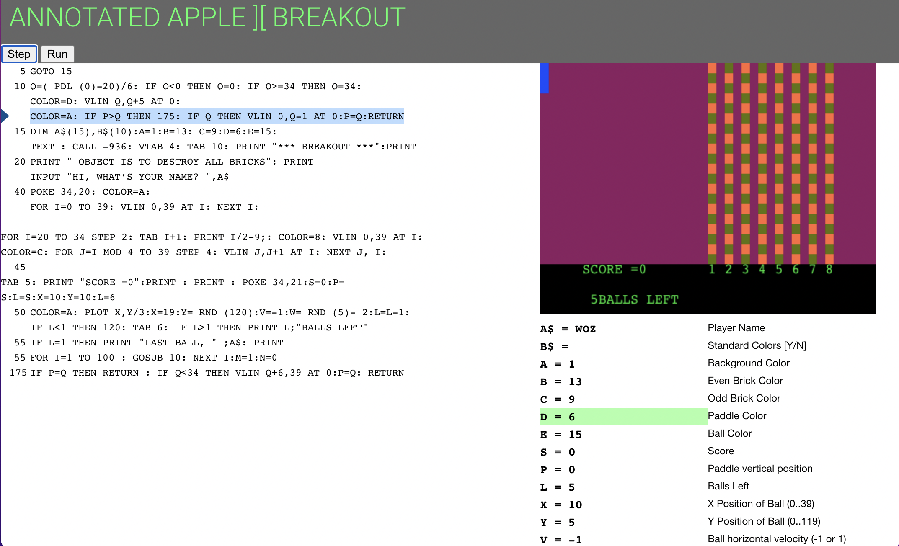
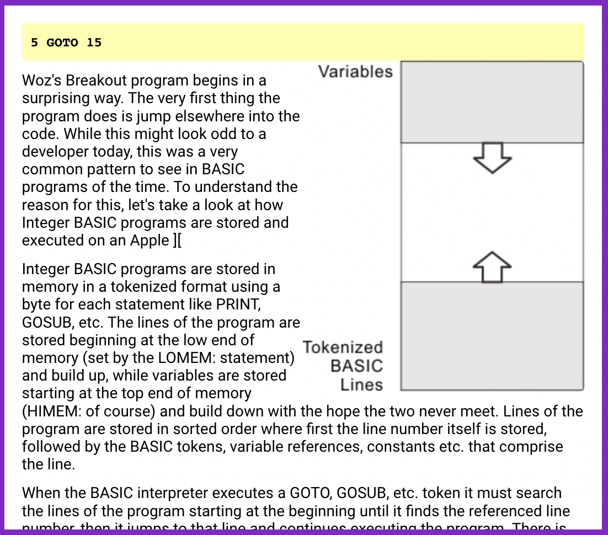

# annotated-breakout

Web site documenting the history and source code of Breakout on the Apple ][. Includes original source code and annotated running on an emulated version of Integer BASIC

## Components

- machine.js provides _just enough_ emulation of the Apple ][ specific BASIC commands for doing LORES graphics and text display/input
- integer-basic.js provides emulation of the BASIC program but does not parse the text. We start from a high-level representation of the _intent_ of the BASIC code represented in Javascript
- breakout.html has the beginnings of annotations for each line of source code.

## Experience

Single-stepping through Breakout with integrated display of mixed LORES+TEXT mode and a live display of BASIC variables and their values and purpose.

As you step through the code, annotation windows can be displayed to explain why some of the code is so odd. It's all about performance!

